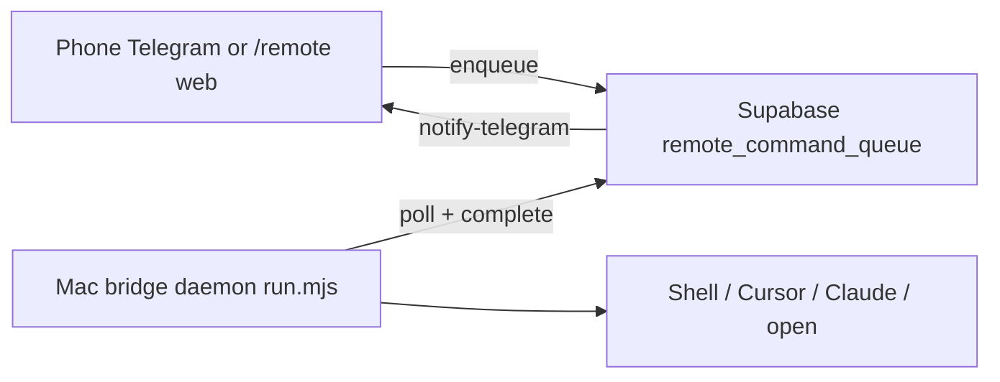

# Remote Control Hub

Your Fendi Control Center already orchestrates credit, tax, and FanFuel from the cloud. **Remote Control Hub** adds the missing piece: commands from your phone that run **on your Mac** (shell, Cursor, Claude CLI) while you are away.

## Architecture



| Layer | Role |
|-------|------|
| **Telegram** | `/mac`, `/computer`, `run on my mac: …` |
| **Web `/remote`** | Mobile-friendly queue UI (requires login) |
| **`remote-bridge-api`** | Enqueue, poll, complete, health |
| **`scripts/remote-bridge/run.mjs`** | Long-running daemon on your Mac |

## Why Telegram alone was not enough

The existing `telegram-webhook` runs on **Supabase Edge** (Deno). It can call APIs, Drive, and other cloud projects, but it **cannot** open Cursor on your machine or run `git` in a local repo. That is why complex “co-work on my computer” requests felt broken—they never had a local executor.

Remote Control Hub does **not** replace Telegram; it **extends** it with a secure queue your Mac pulls from.

## Setup checklist

### 1. Database

Apply migration: `supabase/migrations/20260602120000_remote_command_queue.sql`

### 2. Deploy edge functions

```bash
supabase functions deploy remote-bridge-api
supabase functions deploy telegram-webhook
```

### 3. Supabase secrets

| Secret | Purpose |
|--------|---------|
| `REMOTE_BRIDGE_TOKEN` | Mac daemon auth (`X-Remote-Bridge-Token`) |
| `REMOTE_BRIDGE_ENQUEUE_KEY` | Optional extra enqueue auth |
| `REMOTE_BRIDGE_DEVICE_NAME` | Default `primary-mac` |
| Existing Telegram secrets | `FendiAIbot`, `TELEGRAM_CHAT_ID`, `TELEGRAM_WEBHOOK_SECRET_TOKEN` |

Re-run `setup-telegram-webhook` after Telegram secret changes.

### 4. Mac daemon

See `scripts/remote-bridge/README.md`. Keep it running in tmux or launchd.

### 5. Verify

- Telegram: `/mac status` → should show online after daemon starts
- Web: open `/remote` while logged in → queue `git status`

## Command reference

| Input | Type | Runs locally |
|-------|------|----------------|
| `/mac status` | health | (cloud only) |
| `/mac git pull` | shell | bash in `REMOTE_BRIDGE_WORKDIR` |
| `/mac cursor fix lint errors` | cursor_agent | `cursor agent --print …` |
| `/mac claude draft reply to client` | claude | `claude -p …` |
| `/mac open https://…` | open_url | macOS `open` |
| `run on my mac: npm test` | shell | natural language prefix |

Destructive shell patterns (`rm -rf`, `sudo`, etc.) are blocked on enqueue.

## Security notes

- Treat `REMOTE_BRIDGE_TOKEN` like a password; rotate if leaked.
- Only your allowlisted Telegram chat can enqueue via the bot.
- Web enqueue requires a logged-in Supabase user (or enqueue key).
- The bridge runs with **your Mac user permissions**—use a dedicated workdir and avoid leaving it on untrusted networks without VPN.

## Fixing legacy Telegram issues

Remote bridge is separate from credit/tax routing. For the main bot:

1. Deploy `telegram-webhook` (Lovable publish does **not** deploy edge functions).
2. Confirm `TELEGRAM_WEBHOOK_SECRET_TOKEN` and run `setup-telegram-webhook`.
3. Match `TELEGRAM_CHAT_ID` to your chat.
4. Schedule `telegram-outbox-flush` (cron) for reliable replies.

## Future extensions

- Multiple Mac devices (per-device tokens)
- Approval step for shell commands
- Tailscale-only bridge URL
- Cursor Cloud Agent API when running headless CI Mac
