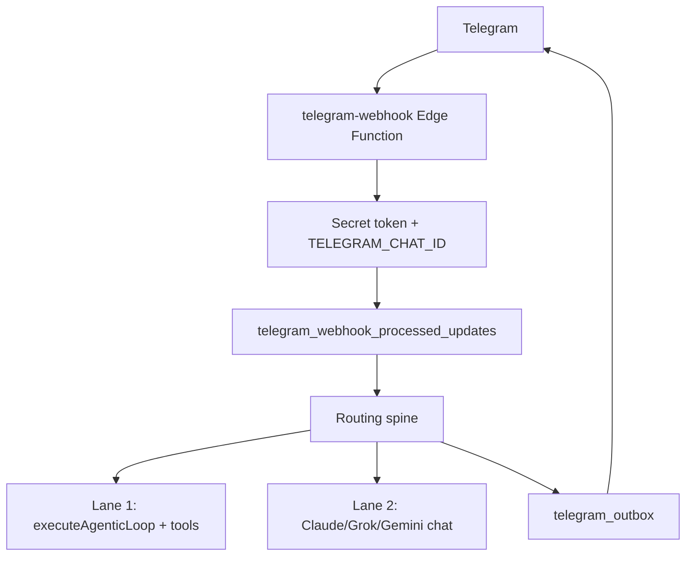

# Telegram diagnostic and fix plan (Fendi Control Center)

**Supabase project (inside Lovable):** `wkzwcfmvnwolgrdpnygc`  
**Primary edge function:** `telegram-webhook` (~8000 lines)

---

## Executive summary

Telegram often “does not work” for **two different reasons**:

1. **Stale edge function** — GitHub `main` has fixes, but **Lovable has not redeployed** `telegram-webhook` to Supabase. Symptoms: `Queued:` on every message, Lane 2 Claude answers slash commands (`/mac`, `/status`), “I don’t have that command”.
2. **Routing design** — Even with a fresh deploy, most messages get `Queued:` first, then pass through auto-promote and heuristics before shortcuts. Credit/exec phrases often fall through to **Lane 2** (chat only, no tools).

Your Mac bridge can be **online** while Telegram still uses an **old webhook bundle** without `/mac` handling.

---

## How Telegram is supposed to work



| Component | Role |
|-----------|------|
| `setup-telegram-webhook` | Registers webhook URL + secret with Telegram |
| `telegram-webhook` | All inbound logic |
| `notify-telegram` | Outbound SOS / document alerts |
| `telegram-outbox-flush` | Retries failed sends (cron or `/resend_failed`) |
| `tasks` / `sessions` | Observability per message |
| `bot_settings` | Model, pending confirms, conversation state |

**Lovable:** Supabase is **inside** Lovable. Pushing to GitHub does **not** automatically update edge functions. You must **deploy functions through Lovable** after sync.

---

## Verify which bundle is live

After deploying, send in Telegram:

```
/ping
```

**New bundle (v2+):** replies with `pong` and `webhook bundle: 2026-06-03-telegram-v2` **without** `Queued:` first.

**Old bundle:** `Queued: <uuid>` then Claude or generic help — **still stale**.

---

## SQL diagnostics (Lovable → SQL editor)

Run in order:

```sql
-- A) Recent tasks — are slash commands hitting Lane 2?
SELECT
  created_at,
  LEFT(request_text, 60) AS req,
  status,
  result_json->>'execution_lane' AS lane,
  result_json->>'progress_step' AS step,
  selected_workflow
FROM tasks
ORDER BY created_at DESC
LIMIT 25;
```

```sql
-- B) Lane 2 on messages that look like commands (bad)
SELECT id, created_at, request_text, result_json->>'progress_step'
FROM tasks
WHERE result_json->>'execution_lane' = 'lane2_assistant'
  AND request_text ~* '^/(mac|status|ping|help|do)'
ORDER BY created_at DESC
LIMIT 15;
```

```sql
-- C) Stuck tasks
SELECT id, created_at, status, LEFT(request_text, 40) AS req
FROM tasks
WHERE status IN ('queued', 'running')
  AND created_at < now() - interval '15 minutes';
```

```sql
-- D) Outbox backlog
SELECT status, COUNT(*) FROM telegram_outbox GROUP BY status;

SELECT id, status, last_error, attempt_count, created_at
FROM telegram_outbox
WHERE status IN ('failed', 'queued', 'sending')
ORDER BY created_at DESC
LIMIT 20;
```

```sql
-- E) Webhook volume (idempotency)
SELECT COUNT(*) AS updates_24h
FROM telegram_webhook_processed_updates
WHERE received_at > now() - interval '24 hours';
```

```sql
-- F) Pending state blocking routing
SELECT setting_key, updated_at, LEFT(setting_value, 80) AS val
FROM bot_settings
WHERE setting_key LIKE '%pending%'
   OR setting_key LIKE '%playlist%'
   OR setting_key LIKE '%pitch%'
ORDER BY updated_at DESC;
```

```sql
-- G) Sessions / model lock
SELECT channel_user_id, active_model, updated_at
FROM sessions
WHERE channel = 'telegram';
```

**Interpretation:**

| Pattern | Meaning |
|---------|---------|
| `lane2_assistant` + `/mac` or `/status` | Stale webhook or shortcut never reached |
| Many `queued`/`running` old rows | Worker timeout or crash mid-handler |
| `telegram_outbox` failed pile | Flush not scheduled; run `/resend_failed` after deploy |
| No `telegram_webhook_processed_updates` rows | Webhook 403/500 before insert — secrets/chat id |

---

## Lovable deploy checklist (required)

1. GitHub `main` synced in Lovable (includes PR #13+ early commands if merged).
2. **Deploy edge function** `telegram-webhook` (and `remote-bridge-api` if using Mac bridge).
3. Secrets in Lovable Supabase panel:
   - `FendiAIbot`
   - `TELEGRAM_CHAT_ID` (your chat id as string)
   - `TELEGRAM_WEBHOOK_SECRET_TOKEN`
   - `REMOTE_BRIDGE_TOKEN` (Mac bridge)
4. Invoke **`setup-telegram-webhook`** once after secret/URL changes.
5. Smoke tests:

| Command | Expected |
|---------|----------|
| `/ping` | `pong` + bundle version, **no Queued** |
| `/mac status` | Mac bridge online/offline |
| `/status` | System status JSON/text |
| `/help` | Command list including `/mac` |

---

## Code issues found (prioritized)

| P | Issue | Fix |
|---|--------|-----|
| P0 | Lovable not deploying `telegram-webhook` | Deploy via Lovable; verify `/ping` bundle string |
| P0 | `/mac` missing in old bundles | Merged PR #13; needs deploy |
| P1 | `Queued:` before shortcuts | Early command handler (v2 bundle) before `createTaskRow` |
| P1 | Credit/exec → Lane 2 | Redeploy + routing docs; regex rescue in `creditDecisionEngine` |
| P1 | Idempotency insert before handler completes | Failed updates dropped permanently |
| P2 | 8k-line monolith | Split into ingress / shortcuts / lanes (later) |
| P2 | Webhook outbox flush not using `claim_outbox_rows` RPC | Align with `telegram-outbox-flush` |
| P3 | `query_credit_compass` Bearer vs Fairway `x-api-key` | Align secrets or tool implementation |

---

## Pathways reference

| Pathway | Trigger | Lane | Needs deploy |
|---------|---------|------|--------------|
| Shortcuts | `/ping`, `/status`, `/help`, … | shortcut | Yes |
| Mac bridge | `/mac`, `run on my mac:` | remote queue | Yes + Mac daemon |
| Tax | tax intents | workflow-runner | Yes |
| Credit auto | “run disputes for …” | Lane 1 | Yes + CG keys |
| Credit miss | vague credit chat | Lane 2 | — |
| Playlist | find playlist … | deterministic / Lane 1 | Yes + FanFuel |
| `/do` | `/do workflow` | Lane 1 | Yes |
| Default | anything else | Lane 2 | Yes |

---

## Why Telegram felt useless

- **Frontend publish ≠ edge deploy** in Lovable.
- **Lane 2** was the default for most messages, including unknown slash commands.
- **No deploy verification** — impossible to tell old vs new bundle until `/ping` shows version.
- **Monolith + many pending states** — hard to debug without SQL `tasks` / `bot_settings`.

---

## Next engineering steps

1. Merge and **Lovable-deploy** early-command + bundle version changes.
2. Schedule **`telegram-outbox-flush`** in Lovable/cron.
3. SQL cleanup: old stuck `tasks`, failed `telegram_outbox`.
4. Optional: split `telegram-webhook` modules after smoke tests pass.

See also: `docs/HANDOFF_CREDIT_TELEGRAM_ROUTING.md`, `supabase/functions/telegram-webhook/FORENSIC_REPORT.md`, `docs/REMOTE_CONTROL_HUB.md`.
