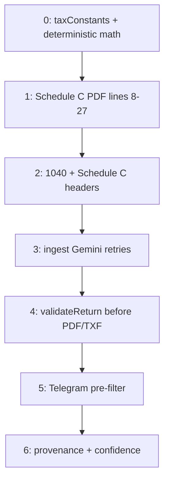

# Tax pipeline roadmap

This repo tracks **implementation** here; the **canonical phased plan** (Phases 0–6) lives in the **Cursor Directive Pack** outside this repository:

- **Directive pack:** `~/Documents/Claude/Projects/Control Hub/Cursor_Directive_Pack.docx`  
  (Tax Pipeline Architecture Fixes — 7 Phases, April 2026)

Use that document for **scope, effort, file targets, and execution order**. Update **this file** when a phase is started, merged, or blocked.

---

## Workflow vs directive targets (important)

**Telegram tax intents**

- **Target architecture:** High-confidence tax intents should flow **Telegram → `workflow-runner` → `generate-tax-documents`** (single orchestration entry).
- **Directive pack Phases 0–4** currently describe edits **directly to `generate-tax-documents`** because that is where math, PDF validation, and ingestion hooks live. That matches **stabilizing internals first**, then layering orchestration without rewriting those internals.

**Do not** replace the workflow-runner path with direct `generate-tax-documents` calls from Telegram mid-fix. **Do** keep **`workflow-runner` as the single entry point** for tax Telegram intents as implemented today.

---

## Two-layer validation model (not competing)

These are **complementary** layers, not competing.

| Layer | Where | When | Question / role | Failure behavior |
|-------|-------|------|-------------------|------------------|
| **Pre-flight** | `supabase/functions/workflow-runner/index.ts` (`validate` stage and related gates) | **Before** calling `generate-tax-documents` | Should we call generate at all? — client resolved, `ingest_summary` present, readiness / missing items, async completion when required. | Sets `status: incomplete` (and related payload); **does not** call `generate-tax-documents`. |
| **Post-compute** | `supabase/functions/generate-tax-documents/index.ts` (Phase 4: `validateReturn` before PDF/TXF) | **After** tax math is computed, **before** PDF/TXF | Are computed numbers internally consistent before emitting artifacts? — schedule math, SE vs AGI, ingestion warnings, etc. | Sets tax return / response to **`validation_failed`** (per Phase 4 spec); **skips PDF and TXF** (unless `force_generate`). |

Mirror this table in the Directive Pack (`.docx`) if you maintain a human-edited summary there.

---

## Phase status (update as you go)

| Phase | Scope (summary) | Status |
|-------|-----------------|--------|
| **0** | Year-aware `taxConstants.ts` + deterministic SE/federal math after Claude | Not started |
| **1** | Schedule C expense lines 8–27 → PDF (`pdfFormFill.ts`) | Not started |
| **2** | 1040 / Schedule 1 flow + Schedule C header fields | Not started |
| **3** | Gemini 503/429 retry (`geminiParser` + ingest) | Not started |
| **4** | Validation gate before PDF/TXF in `generate-tax-documents` | Not started |
| **5** | Telegram deterministic pre-filter (before Gemini classifier) — **verify line numbers** in `telegram-webhook` | Not started |
| **6** | Source provenance + confidence tagging | Not started |

**Related work in this repo (separate from phase numbers):** deterministic **workflow** orchestration (`workflow-runner`, `parse_user_inputs`, ingest ordering, merge, workflow-level readiness / incomplete responses). That does **not** replace Phase 0 or Phase 4; it complements them.

---

## Execution order (directive pack)

Order is **fixed in the Directive Pack**: Phase **0** (deterministic math) **before** Phase **4** (validation gate). Phases **1–2** (PDF mapping) after Phase 0 stabilizes outputs. Phase **5** (Telegram pre-filter) **last**, with **current line numbers verified** in `telegram-webhook` at implementation time.

**Dependency note:** Phase **4** assumes Phase **0** math exists so validation checks deterministic numbers. The **Directive Pack** is authoritative if this diagram ever diverges.

---

## Deployment (from directive pack)

- Code → **GitHub `main`**; **Lovable** deploys edge functions only (no Lovable-authored code).
- **Supabase schema** changes → **Lovable SQL runner** only.

---

## Changelog

| Date | Note |
|------|------|
| 2026-04-13 | Initial `docs/pipeline-roadmap.md`; links Directive Pack, two-layer validation, workflow entry point. |
| 2026-04-13 | Two-layer table: added When + failure behavior; execution-order diagram; aligned with response to Cursor feedback. |
